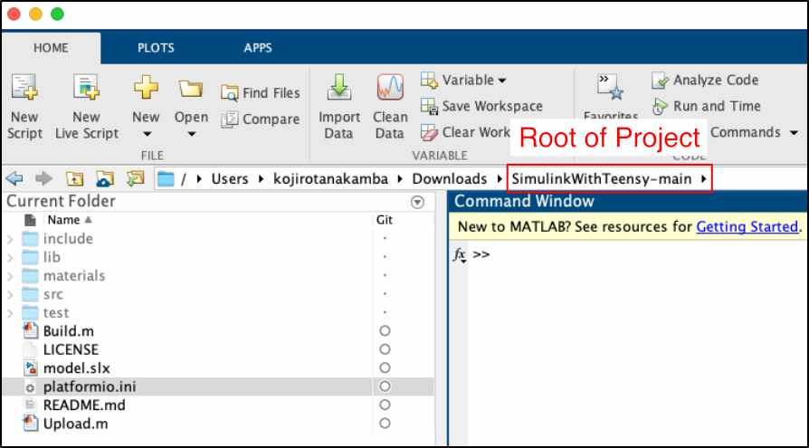
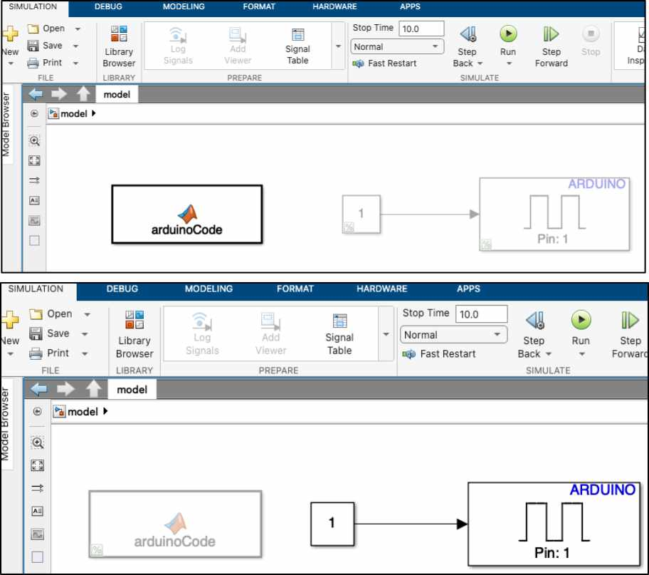
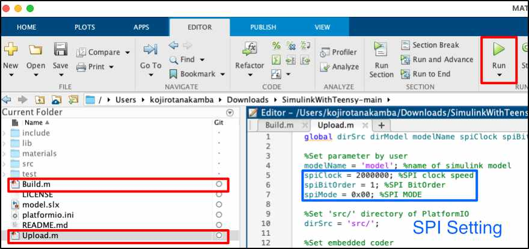

# SimulinkWithTeensy

## Overview
**SimulinkWithTeensy** is a PlatformIO project to use simulink with Teensy. I want to develop Teensy softwares using simulink for my research, then, I created this project. 

## Requirements

- MATLAB/Simulink (Operation Check with R2022a)
- MATLAB Support Package for Arduino Hardware (Operation Check with 22.1.2)
- Simulink Support Package for Arduino Hardware (Operation Check with 22.1.4)
- Embedded Coder (Operation Check with 7.4)
- Simulink Coder (Operation Check with 9.7)
- PlatformIO (Operation Check with Core: 6.1.5, home: 3.4.3)
- Teensy (Operation Check with Teensy3.5)

In addition, I developed and used this project using macOS (PC: Mac mini 2018, CPU: 3.2 GHz 6-Core Intel Core i7, OS: Ventura).

## Demo

## Usage
1. Move the root directory of the project in MATLAB workspace.

2. Edit the model.slx in Simulink workspace. To make Teensy model, the arduino library is used. (I usually use MATLAB function block to make Teensy/Arduino model).

3. After editing model.slx, run M-file of **Build** or **Upload**. When the files run, Simulink generates codes of the model.slx using Embedded Coder, then, the codes are sent to 'src/' directory. Then, Platform IO **Builds** or **Uploads** the codes for Teensy. In addition, SPI configure can be set in the M-files.

## Features

- src (Directory)
Codes of simulink and generated main.cpp are included in this directory.

- materials(Directory)
Materials to generate main.cpp (main_base.cpp, pwmInfo.txt) and images for README.md are included in this directory.

- model.slx
Simulink file

- platformio.ini
Configure files of PlatformIO. In this file, you can choose a hardware target what you want. The default target hardware is Teensy3.5 in this project.

- Build.m
M-file to generate the C-codes of the model.slx and build the codes for Teensy hardware.

- Upload.m
M-file to generate the C-codes of the model.slx and build and upload the codes for a Teensy hardware.

## License

MIT License

## Notice
Since this project was developed for my research, there is no guarantee that MATLAB/Simulink corresponds perfectly to Teensy hardware. I shall not be responsible for any loss, damages and troubles using this project.
 
